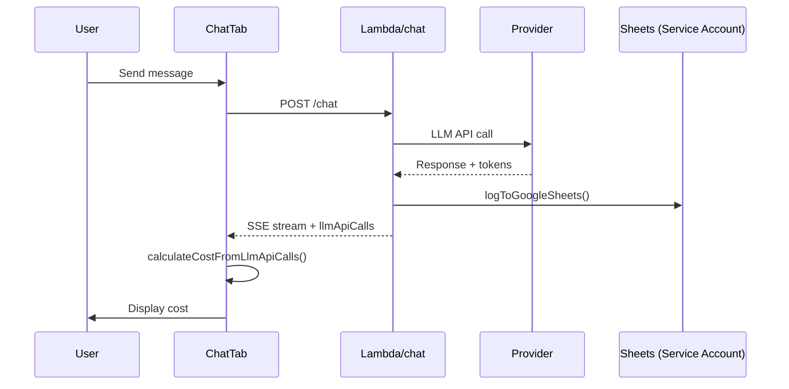
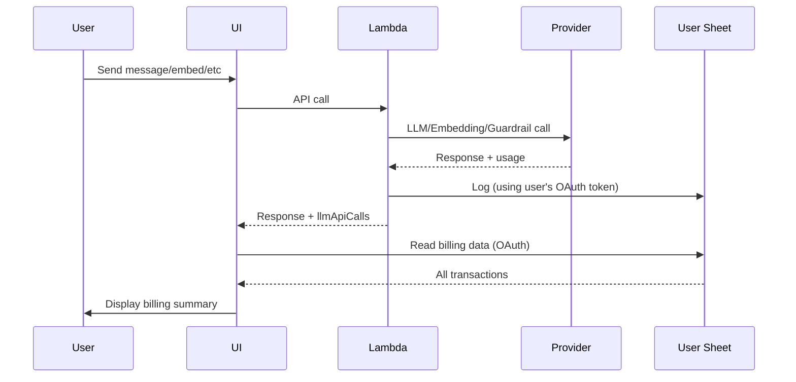
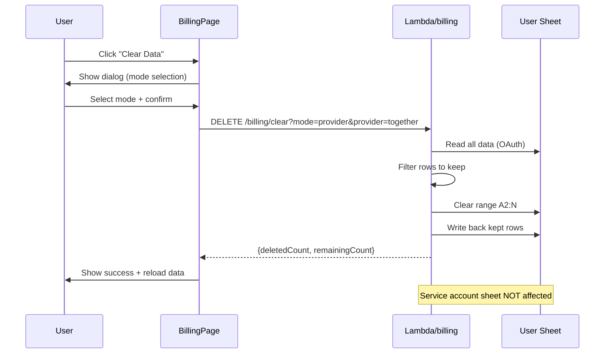

# Pricing & Billing System Review and Enhancement Plan

**Date**: October 20, 2025  
**Status**: 📋 Planning Phase  
**Priority**: HIGH - Revenue Protection & Accuracy

---

## 🎯 Key Features

### New Capabilities

1. **Complete Cost Tracking** 💰
   - All LLM calls logged (chat, embeddings, guardrails, planning)
   - Lambda execution metrics (duration, memory)
   - Accurate pricing for all providers

2. **User-Owned Billing Sheet** 📊
   - Personal "Research Agent Billing" sheet in your Google Drive
   - Direct access to your billing data
   - No dependency on admin endpoints

3. **Comprehensive Billing Dashboard** 📈
   - Breakdown by type (chat/embedding/guardrail)
   - Breakdown by provider (OpenAI/Gemini/Groq/TogetherAI)
   - Breakdown by model
   - Date range filtering
   - CSV export

4. **Clear Billing Data** 🗑️ **NEW**
   - Clear all transactions (fresh start)
   - Clear by provider (align with provider billing cycles)
   - Clear by date range (remove old data)
   - Safety: Confirmation dialog + preview count
   - Security: Only your sheet affected, admin log preserved

**Use Cases for Clear Data**:
- 📅 **Billing Cycle Alignment**: Clear provider data monthly to match their billing period
- 🧪 **Testing Reset**: Clear test transactions before production tracking
- 💰 **Cost Reconciliation**: Align tracking with provider invoices
- 🧹 **Privacy & Performance**: Remove old transaction history

---

## 🚨 Problem Statement

### Current Issues

1. **Pricing Discrepancy**
   - Header total increasing faster than TogetherAI balance
   - Not accounting for free tier usage properly
   - Mismatch between UI calculations and actual provider costs

2. **Incomplete Cost Tracking**
   - ❌ Embedding calls NOT logged
   - ❌ Guardrail calls NOT logged  
   - ❌ Lambda function duration/memory NOT tracked
   - ✅ Chat LLM calls ARE logged (but may have pricing errors)

3. **Logging Gaps**
   - Current: Only chat endpoint logs to Google Sheets
   - Missing: Embeddings, guardrails, other LLM endpoints
   - Missing: Lambda execution metrics (duration, memory)

4. **UI Data Source**
   - Current: Uses `/usage` endpoint (reads service account sheet)
   - Desired: Read user's own Google Sheet directly
   - Issue: `/usage` endpoint has stale or incorrect data. avoid costs of extra call to lambda

---

## 🎯 Goals

### Phase 1: Audit & Fix Pricing (Week 1)
1. ✅ Review all pricing calculations against actual provider pricing
2. ✅ Identify discrepancies in free vs paid tier handling
3. ✅ Fix calculation errors in `ui-new/src/utils/pricing.ts`
4. ✅ Fix calculation errors in `src/services/google-sheets-logger.js`
5. ✅ Verify TogetherAI free tier handling. There is no free tier for together ai

### Phase 2: Expand Logging System (Week 1-2)
1. ✅ Log embedding API calls to Google Sheets
2. ✅ Log guardrail API calls to Google Sheets
3. ✅ Log all other LLM endpoints (planning, etc.)
4. ✅ Log Lambda execution metrics (duration, memory limit)
5. ✅ Create user-owned "Research Agent Billing" sheet

### Phase 3: User-Owned Billing Sheet (Week 2)
1. ✅ Create sheet in user's "Research Agent" folder
2. ✅ Schema: Timestamp, Type, Model, Provider, Tokens, Cost, Duration, Memory
3. ✅ Log all activity types (chat, embedding, guardrail, planning)
4. ✅ UI reads directly from user's sheet (not /usage endpoint)
5. ✅ Deprecate /usage endpoint

### Phase 4: Billing UI Page (Week 2-3)
1. ✅ Create new Settings → Billing page
2. ✅ Show totals by model type (whisper/embedding/llm/guardrail)
3. ✅ Show totals by provider
4. ✅ Show totals by provider-model combination
5. ✅ Show date range selector
6. ✅ Export functionality
7. ✅ Clear data functionality with three modes:
   - Clear all transactions
   - Clear by provider (align with provider billing cycles)
   - Clear by date range (remove old data)

---

## 📊 Current Architecture

### Logging Infrastructure

**Files**:
- `src/services/google-sheets-logger.js` - Main logging service
- `src/endpoints/chat.js` - Calls logger after chat completion
- `src/endpoints/planning.js` - Does NOT log currently
- `src/endpoints/rag.js` - Does NOT log embeddings currently
- `src/guardrails/*` - Guardrail calls tracked in llmApiCalls but NOT logged to sheets

**Current Sheet Structure** (LLM Usage Log):
```
Timestamp | User Email | Provider | Model | Tokens In | Tokens Out | Total Tokens | Cost ($) | Duration (s) | Error Code | Error Message
```

### Pricing Calculations

**Backend** (`src/services/google-sheets-logger.js`):
```javascript
const PRICING = {
  // Gemini models (free tier)
  'gemini-2.0-flash-exp': { input: 0, output: 0 },
  'gemini-1.5-flash': { input: 0, output: 0 },
  'gemini-1.5-flash-8b': { input: 0, output: 0 },
  'gemini-1.5-pro': { input: 0, output: 0 },
  
  // OpenAI models
  'gpt-4o': { input: 2.50, output: 10.00 },
  'gpt-4o-mini': { input: 0.15, output: 0.60 },
  'gpt-4o-2024-08-06': { input: 2.50, output: 10.00 },
  
  // Groq models (free tier)
  'llama-3.3-70b-versatile': { input: 0, output: 0 },
  'llama-3.1-70b-versatile': { input: 0, output: 0 },
  // ... etc
};
```

**Frontend** (`ui-new/src/utils/pricing.ts`):
- 40+ models with pricing data
- `calculateCost()` - Calculate per-call cost
- `calculateDualPricing()` - Handle free tier + paid equivalent
- `formatCost()` - Display formatting

**Issue**: Two separate pricing databases that can drift out of sync!

### Current Call Flow



**Problems**:
1. UI calculates cost independently (can differ from backend)
2. Only chat endpoint logs
3. Embeddings/guardrails not logged
4. User can't see their own billing data

---

## 🏗️ Proposed Architecture

### New Logging Flow



**Benefits**:
1. ✅ User owns their billing data
2. ✅ Single source of truth (user's sheet)
3. ✅ All call types logged (chat, embed, guardrail)
4. ✅ Lambda metrics included
5. ✅ No /usage endpoint needed

### New Sheet Structure

**Sheet Name**: `Research Agent Billing`  
**Location**: `Research Agent` folder in user's Google Drive

**Columns**:
```
Timestamp | Type | Provider | Model | Tokens In | Tokens Out | Total Tokens | Cost ($) | Duration (ms) | Memory (MB) | User Email | Status | Error
```

**Type Values**:
- `chat` - Chat completions
- `embedding` - Text embeddings
- `guardrail_input` - Input content moderation
- `guardrail_output` - Output content moderation
- `planning` - Planning LLM calls
- `search` - Search LLM calls (if applicable)
- `whisper` - Audio transcription (future)

### Clear Data Workflow



**Clear Modes**:
1. **All** - Delete all transactions (fresh start)
2. **Provider** - Delete transactions from specific provider (e.g., "together")
3. **Date Range** - Delete transactions within date range (e.g., before Oct 1)

**Safety Features**:
- ⚠️ Confirmation dialog with warning
- 📊 Preview deletion count before action
- 💾 Recommend CSV export first
- 🔒 Only user's sheet affected (admin backup preserved)

---

## 📝 Implementation Plan

### Phase 1: Pricing Audit & Fixes (3-4 hours)

#### Task 1.1: Audit Provider Pricing

**File**: `PRICING_AUDIT.md` (new)

**Actions**:
1. Check OpenAI pricing page: https://openai.com/api/pricing/
2. Check TogetherAI pricing: https://www.together.ai/pricing
3. Check Groq pricing: https://groq.com/pricing/
4. Check Anthropic pricing: https://www.anthropic.com/pricing
5. Check Google Gemini pricing: https://ai.google.dev/pricing

**Document**:
- Current pricing in code vs actual pricing
- Free tier models and limits
- Discrepancies found
- Recommended fixes

#### Task 1.2: Fix Backend Pricing

**File**: `src/services/google-sheets-logger.js`

**Changes**:
```javascript
const PRICING = {
  // OpenAI (verified 2025-10-20)
  'gpt-4o': { input: 2.50, output: 10.00 },
  'gpt-4o-mini': { input: 0.15, output: 0.60 },
  'gpt-4o-2024-08-06': { input: 2.50, output: 10.00 },
  
  // TogetherAI (verified 2025-10-20)
  'meta-llama/Meta-Llama-3.1-8B-Instruct-Turbo': { input: 0.18, output: 0.18 },
  'meta-llama/Meta-Llama-3.1-70B-Instruct-Turbo': { input: 0.88, output: 0.88 },
  'meta-llama/Llama-3.2-90B-Vision-Instruct-Turbo': { input: 1.20, output: 1.20 },
  
  // TogetherAI FREE TIER (verify limits)
  'together-free:meta-llama/Meta-Llama-3.1-8B-Instruct-Turbo': { input: 0, output: 0 },
  
  // Embeddings (NEW - currently not tracked!)
  'text-embedding-3-small': { input: 0.02, output: 0 }, // OpenAI $0.02 per 1M tokens
  'text-embedding-3-large': { input: 0.13, output: 0 }, // OpenAI $0.13 per 1M tokens
  
  // Guardrails (use model pricing - same as chat)
  // ... existing models apply ...
};
```

**Add Function**:
```javascript
/**
 * Calculate cost for any LLM call type (chat, embedding, guardrail)
 * @param {string} type - Call type (chat, embedding, guardrail_input, guardrail_output)
 * @param {string} model - Model name
 * @param {number} inputTokens - Input tokens
 * @param {number} outputTokens - Output tokens (0 for embeddings)
 * @returns {number} Cost in dollars
 */
function calculateCostForType(type, model, inputTokens, outputTokens) {
  // For embeddings, output tokens should be 0
  if (type === 'embedding') {
    outputTokens = 0;
  }
  
  // Use existing PRICING lookup
  const modelPricing = PRICING[model] || { input: 0, output: 0 };
  const inputCost = (inputTokens / 1000000) * modelPricing.input;
  const outputCost = (outputTokens / 1000000) * modelPricing.output;
  
  return inputCost + outputCost;
}
```

#### Task 1.3: Fix Frontend Pricing

**File**: `ui-new/src/utils/pricing.ts`

**Actions**:
1. Review `PRICING_DATABASE` - update all model prices
2. Add missing TogetherAI models
3. Add embedding models
4. Ensure free tier models have `isFree: true`
5. Add comments with last verified date

**Testing**:
- Compare frontend `calculateCost()` with backend `calculateCost()`
- Verify same input/output gives same result
- Test free tier models show $0 actual, paid equivalent

#### Task 1.4: Create Pricing Test Suite

**File**: `tests/unit/pricing-accuracy.test.js` (new)

**Tests**:
```javascript
describe('Pricing Accuracy', () => {
  test('Backend and frontend pricing match', () => {
    // Compare PRICING from both files
  });
  
  test('Free tier models cost $0', () => {
    // Verify all free models
  });
  
  test('TogetherAI free tier handled correctly', () => {
    // Verify together-free prefix
  });
  
  test('Embedding models priced correctly', () => {
    // Test embedding-specific pricing
  });
});
```

---

### Phase 2: Expand Logging to All LLM Calls (6-8 hours)

#### Task 2.1: Log Embedding Calls

**File**: `src/endpoints/rag.js`

**Current State**:
- `handleEmbedSnippets()` generates embeddings
- Returns chunks with embeddings to client
- Does NOT log to Google Sheets

**Changes**:
```javascript
const { logToGoogleSheets } = require('../services/google-sheets-logger');

async function handleEmbedSnippets(body, writeEvent, responseStream) {
  const startTime = Date.now();
  // ... existing code ...
  
  try {
    // ... generate embeddings ...
    
    // NEW: Log each embedding batch
    for (const snippet of snippets) {
      const chunkTexts = chunks.map(c => c.chunk_text);
      const totalTokens = chunkTexts.reduce((sum, text) => sum + Math.ceil(text.length / 4), 0);
      
      await logToGoogleSheets({
        timestamp: new Date().toISOString(),
        userEmail: decodedToken.email || 'unknown',
        provider: 'openai', // or extract from body
        model: 'text-embedding-3-small',
        promptTokens: totalTokens,
        completionTokens: 0, // embeddings don't have output tokens
        totalTokens: totalTokens,
        durationMs: Date.now() - startTime,
        type: 'embedding' // NEW field
      });
    }
    
    // ... return response ...
  }
}
```

**Also Update**: `/rag/embed-query` endpoint (if exists)

#### Task 2.2: Log Guardrail Calls

**File**: `src/endpoints/chat.js`

**Current State**:
- Guardrail calls tracked in `allLlmApiCalls` array
- Sent to client but NOT logged to Google Sheets

**Changes**:
```javascript
// After guardrail validation (input)
if (guardrailValidator) {
  const inputValidation = await guardrailValidator.validateInput(text);
  
  // Track in llmApiCalls (already done)
  allLlmApiCalls.push(guardrailApiCall);
  
  // NEW: Also log to Google Sheets
  await logToGoogleSheets({
    timestamp: new Date().toISOString(),
    userEmail: decodedToken.email || 'unknown',
    provider: inputValidation.tracking.provider,
    model: inputValidation.tracking.model,
    promptTokens: inputValidation.tracking.promptTokens,
    completionTokens: inputValidation.tracking.completionTokens,
    totalTokens: inputValidation.tracking.promptTokens + inputValidation.tracking.completionTokens,
    durationMs: inputValidation.tracking.duration,
    type: 'guardrail_input' // NEW field
  });
}

// After guardrail validation (output) - same pattern
```

#### Task 2.3: Log Planning Calls

**File**: `src/endpoints/planning.js`

**Current State**: Unknown (need to check if exists)

**If exists, add**:
```javascript
const { logToGoogleSheets } = require('../services/google-sheets-logger');

async function handler(event, responseStream) {
  const startTime = Date.now();
  // ... existing planning logic ...
  
  // After LLM generates plan
  await logToGoogleSheets({
    timestamp: new Date().toISOString(),
    userEmail: decodedToken.email || 'unknown',
    provider: extractProvider(model),
    model: extractModel(model),
    promptTokens: response.usage.prompt_tokens,
    completionTokens: response.usage.completion_tokens,
    totalTokens: response.usage.total_tokens,
    durationMs: Date.now() - startTime,
    type: 'planning'
  });
}
```

#### Task 2.4: Add Lambda Metrics to Logging

**File**: `src/services/google-sheets-logger.js`

**Update Schema**:
```javascript
/**
 * @param {number} logData.memoryLimitMB - Lambda memory limit
 * @param {number} logData.memoryUsedMB - Peak memory used
 * @param {string} logData.requestId - Lambda request ID
 */
async function logToGoogleSheets(logData) {
  // ... existing code ...
  
  const rowData = [
    logData.timestamp,
    logData.userEmail || 'unknown',
    logData.type || 'chat', // NEW: call type
    logData.provider || 'unknown',
    logData.model || 'unknown',
    logData.promptTokens || 0,
    logData.completionTokens || 0,
    logData.totalTokens || 0,
    cost.toFixed(4),
    (logData.durationMs / 1000).toFixed(2),
    logData.memoryLimitMB || '', // NEW
    logData.memoryUsedMB || '', // NEW
    logData.requestId || '', // NEW
    logData.errorCode || '',
    logData.errorMessage || ''
  ];
  
  // ... append to sheet ...
}
```

**Update All Endpoints**:
```javascript
// In each endpoint handler
const memoryLimit = context.memoryLimitInMB || parseInt(process.env.AWS_LAMBDA_FUNCTION_MEMORY_SIZE) || 512;
const memoryUsage = process.memoryUsage();
const memoryUsedMB = Math.round(memoryUsage.heapUsed / (1024 * 1024));

await logToGoogleSheets({
  // ... existing fields ...
  memoryLimitMB: memoryLimit,
  memoryUsedMB: memoryUsedMB,
  requestId: context.requestId || 'local'
});
```

---

### Phase 3: User-Owned Billing Sheet (4-6 hours)

#### Task 3.1: Create Sheet Management Service

**File**: `src/services/user-billing-sheet.js` (NEW)

```javascript
/**
 * User Billing Sheet Service
 * Manages user's personal "Research Agent Billing" sheet
 */

/**
 * Get or create user's billing sheet
 * @param {string} userEmail - User's email
 * @param {string} accessToken - User's OAuth token
 * @returns {Promise<string>} Spreadsheet ID
 */
async function getOrCreateBillingSheet(userEmail, accessToken) {
  // 1. Search for "Research Agent" folder
  const folderId = await findOrCreateFolder('Research Agent', accessToken);
  
  // 2. Search for "Research Agent Billing" sheet in folder
  let sheetId = await findSheetInFolder('Research Agent Billing', folderId, accessToken);
  
  // 3. If not found, create new sheet
  if (!sheetId) {
    sheetId = await createBillingSheet(folderId, accessToken);
  }
  
  return sheetId;
}

/**
 * Initialize billing sheet with headers
 */
async function initializeBillingSheet(sheetId, accessToken) {
  const headers = [
    'Timestamp',
    'Type',
    'Provider',
    'Model',
    'Tokens In',
    'Tokens Out',
    'Total Tokens',
    'Cost ($)',
    'Duration (ms)',
    'Memory Limit (MB)',
    'Memory Used (MB)',
    'Request ID',
    'Status',
    'Error'
  ];
  
  await updateSheetRange(sheetId, 'A1:N1', [headers], accessToken);
}

/**
 * Log transaction to user's billing sheet
 */
async function logToBillingSheet(sheetId, transaction, accessToken) {
  const row = [
    transaction.timestamp,
    transaction.type,
    transaction.provider,
    transaction.model,
    transaction.tokensIn,
    transaction.tokensOut,
    transaction.totalTokens,
    transaction.cost.toFixed(4),
    transaction.durationMs,
    transaction.memoryLimitMB || '',
    transaction.memoryUsedMB || '',
    transaction.requestId || '',
    transaction.status || 'success',
    transaction.error || ''
  ];
  
  await appendToSheet(sheetId, 'A:N', [row], accessToken);
}

module.exports = {
  getOrCreateBillingSheet,
  initializeBillingSheet,
  logToBillingSheet
};
```

#### Task 3.2: Integrate User Sheet Logging

**File**: `src/endpoints/chat.js` (and other endpoints)

```javascript
const { logToBillingSheet, getOrCreateBillingSheet } = require('../services/user-billing-sheet');

async function handler(event, responseStream) {
  // ... after authentication ...
  const accessToken = event.headers.authorization.split(' ')[1];
  const userEmail = decodedToken.email;
  
  // Get user's billing sheet ID
  const billingSheetId = await getOrCreateBillingSheet(userEmail, accessToken);
  
  // ... process request ...
  
  // Log to user's sheet (in addition to service account sheet)
  await logToBillingSheet(billingSheetId, {
    timestamp: new Date().toISOString(),
    type: 'chat',
    provider: provider,
    model: model,
    tokensIn: promptTokens,
    tokensOut: completionTokens,
    totalTokens: totalTokens,
    cost: calculateCostForType('chat', model, promptTokens, completionTokens),
    durationMs: Date.now() - startTime,
    memoryLimitMB: context.memoryLimitInMB,
    memoryUsedMB: memoryUsedMB,
    requestId: context.requestId
  }, accessToken);
  
  // Also log to service account sheet (for admin monitoring)
  await logToGoogleSheets({ /* ... */ });
}
```

**Apply to**:
- `/chat` endpoint
- `/rag/embed-snippets` endpoint
- `/rag/embed-query` endpoint
- `/planning` endpoint (if exists)
- Guardrail calls

#### Task 3.3: Create Billing Data API

**File**: `src/endpoints/billing.js` (NEW)

```javascript
/**
 * GET /billing - Get user's billing data from their sheet
 * 
 * Query params:
 * - startDate: ISO date (optional)
 * - endDate: ISO date (optional)
 * - type: filter by type (optional)
 * - provider: filter by provider (optional)
 */
async function handleBillingRequest(event) {
  // 1. Verify auth token
  const accessToken = event.headers.authorization.split(' ')[1];
  const payload = await verifyGoogleToken(accessToken);
  const userEmail = payload.email;
  
  // 2. Get user's billing sheet
  const sheetId = await getOrCreateBillingSheet(userEmail, accessToken);
  
  // 3. Read all data
  const data = await readSheetRange(sheetId, 'A2:N', accessToken);
  
  // 4. Parse and filter
  const transactions = data.values.map(row => ({
    timestamp: row[0],
    type: row[1],
    provider: row[2],
    model: row[3],
    tokensIn: parseInt(row[4]) || 0,
    tokensOut: parseInt(row[5]) || 0,
    totalTokens: parseInt(row[6]) || 0,
    cost: parseFloat(row[7]) || 0,
    durationMs: parseInt(row[8]) || 0,
    memoryLimitMB: parseInt(row[9]) || 0,
    memoryUsedMB: parseInt(row[10]) || 0,
    requestId: row[11] || '',
    status: row[12] || 'success',
    error: row[13] || ''
  }));
  
  // 5. Apply filters
  let filtered = transactions;
  
  if (event.queryStringParameters?.startDate) {
    filtered = filtered.filter(t => new Date(t.timestamp) >= new Date(event.queryStringParameters.startDate));
  }
  
  if (event.queryStringParameters?.endDate) {
    filtered = filtered.filter(t => new Date(t.timestamp) <= new Date(event.queryStringParameters.endDate));
  }
  
  if (event.queryStringParameters?.type) {
    filtered = filtered.filter(t => t.type === event.queryStringParameters.type);
  }
  
  if (event.queryStringParameters?.provider) {
    filtered = filtered.filter(t => t.provider === event.queryStringParameters.provider);
  }
  
  // 6. Calculate aggregates
  const totals = {
    totalCost: filtered.reduce((sum, t) => sum + t.cost, 0),
    totalTokens: filtered.reduce((sum, t) => sum + t.totalTokens, 0),
    totalRequests: filtered.length,
    
    byType: {},
    byProvider: {},
    byModel: {},
    
    dateRange: {
      start: filtered.length > 0 ? filtered[0].timestamp : null,
      end: filtered.length > 0 ? filtered[filtered.length - 1].timestamp : null
    }
  };
  
  // Group by type
  for (const t of filtered) {
    if (!totals.byType[t.type]) {
      totals.byType[t.type] = { cost: 0, tokens: 0, requests: 0 };
    }
    totals.byType[t.type].cost += t.cost;
    totals.byType[t.type].tokens += t.totalTokens;
    totals.byType[t.type].requests++;
  }
  
  // Group by provider
  for (const t of filtered) {
    if (!totals.byProvider[t.provider]) {
      totals.byProvider[t.provider] = { cost: 0, tokens: 0, requests: 0 };
    }
    totals.byProvider[t.provider].cost += t.cost;
    totals.byProvider[t.provider].tokens += t.totalTokens;
    totals.byProvider[t.provider].requests++;
  }
  
  // Group by model
  for (const t of filtered) {
    const key = `${t.provider}:${t.model}`;
    if (!totals.byModel[key]) {
      totals.byModel[key] = { cost: 0, tokens: 0, requests: 0, provider: t.provider, model: t.model };
    }
    totals.byModel[key].cost += t.cost;
    totals.byModel[key].tokens += t.totalTokens;
    totals.byModel[key].requests++;
  }
  
  return {
    statusCode: 200,
    headers: { 'Content-Type': 'application/json' },
    body: JSON.stringify({
      transactions: filtered,
      totals: totals
    })
  };
}

module.exports = { handleBillingRequest };
```

**Add to router** (`index.js`):
```javascript
if (path === '/billing' && method === 'GET') {
  return billingEndpoint.handleBillingRequest(event);
}
```

---

### Phase 4: Billing UI Page (6-8 hours)

#### Task 4.1: Create Billing Page Component

**File**: `ui-new/src/components/BillingPage.tsx` (NEW)

```typescript
import React, { useState, useEffect } from 'react';
import { useAuth } from '../contexts/AuthContext';

interface Transaction {
  timestamp: string;
  type: string;
  provider: string;
  model: string;
  tokensIn: number;
  tokensOut: number;
  totalTokens: number;
  cost: number;
  durationMs: number;
  memoryLimitMB: number;
  memoryUsedMB: number;
  requestId: string;
  status: string;
  error: string;
}

interface BillingTotals {
  totalCost: number;
  totalTokens: number;
  totalRequests: number;
  byType: Record<string, { cost: number; tokens: number; requests: number }>;
  byProvider: Record<string, { cost: number; tokens: number; requests: number }>;
  byModel: Record<string, { cost: number; tokens: number; requests: number; provider: string; model: string }>;
  dateRange: { start: string | null; end: string | null };
}

export function BillingPage() {
  const { accessToken } = useAuth();
  const [transactions, setTransactions] = useState<Transaction[]>([]);
  const [totals, setTotals] = useState<BillingTotals | null>(null);
  const [loading, setLoading] = useState(true);
  const [error, setError] = useState<string | null>(null);
  
  // Filters
  const [startDate, setStartDate] = useState('');
  const [endDate, setEndDate] = useState('');
  const [typeFilter, setTypeFilter] = useState('');
  const [providerFilter, setProviderFilter] = useState('');
  
  // View mode
  const [viewMode, setViewMode] = useState<'summary' | 'details'>('summary');
  
  useEffect(() => {
    loadBillingData();
  }, [startDate, endDate, typeFilter, providerFilter]);
  
  const loadBillingData = async () => {
    setLoading(true);
    setError(null);
    
    try {
      const params = new URLSearchParams();
      if (startDate) params.append('startDate', startDate);
      if (endDate) params.append('endDate', endDate);
      if (typeFilter) params.append('type', typeFilter);
      if (providerFilter) params.append('provider', providerFilter);
      
      const response = await fetch(`${import.meta.env.VITE_API_BASE}/billing?${params}`, {
        headers: {
          'Authorization': `Bearer ${accessToken}`
        }
      });
      
      if (!response.ok) throw new Error('Failed to load billing data');
      
      const data = await response.json();
      setTransactions(data.transactions);
      setTotals(data.totals);
    } catch (err) {
      setError(err.message);
    } finally {
      setLoading(false);
    }
  };
  
  const formatCost = (cost: number) => {
    if (cost === 0) return '$0.00';
    if (cost < 0.0001) return '<$0.0001';
    if (cost < 0.01) return `$${cost.toFixed(4)}`;
    return `$${cost.toFixed(3)}`;
  };
  
  return (
    <div className="p-6 max-w-7xl mx-auto">
      <h1 className="text-3xl font-bold mb-6">💰 Billing & Usage</h1>
      
      {/* Filters */}
      <div className="bg-white dark:bg-gray-800 rounded-lg shadow p-4 mb-6">
        <div className="grid grid-cols-1 md:grid-cols-4 gap-4">
          <div>
            <label className="block text-sm font-medium mb-1">Start Date</label>
            <input
              type="date"
              value={startDate}
              onChange={(e) => setStartDate(e.target.value)}
              className="w-full px-3 py-2 border rounded"
            />
          </div>
          
          <div>
            <label className="block text-sm font-medium mb-1">End Date</label>
            <input
              type="date"
              value={endDate}
              onChange={(e) => setEndDate(e.target.value)}
              className="w-full px-3 py-2 border rounded"
            />
          </div>
          
          <div>
            <label className="block text-sm font-medium mb-1">Type</label>
            <select
              value={typeFilter}
              onChange={(e) => setTypeFilter(e.target.value)}
              className="w-full px-3 py-2 border rounded"
            >
              <option value="">All Types</option>
              <option value="chat">Chat</option>
              <option value="embedding">Embedding</option>
              <option value="guardrail_input">Guardrail (Input)</option>
              <option value="guardrail_output">Guardrail (Output)</option>
              <option value="planning">Planning</option>
            </select>
          </div>
          
          <div>
            <label className="block text-sm font-medium mb-1">Provider</label>
            <select
              value={providerFilter}
              onChange={(e) => setProviderFilter(e.target.value)}
              className="w-full px-3 py-2 border rounded"
            >
              <option value="">All Providers</option>
              <option value="openai">OpenAI</option>
              <option value="gemini">Gemini</option>
              <option value="groq">Groq</option>
              <option value="together">TogetherAI</option>
              <option value="anthropic">Anthropic</option>
            </select>
          </div>
        </div>
      </div>
      
      {/* View Mode Toggle */}
      <div className="flex gap-2 mb-6">
        <button
          onClick={() => setViewMode('summary')}
          className={`px-4 py-2 rounded ${viewMode === 'summary' ? 'bg-blue-500 text-white' : 'bg-gray-200'}`}
        >
          Summary
        </button>
        <button
          onClick={() => setViewMode('details')}
          className={`px-4 py-2 rounded ${viewMode === 'details' ? 'bg-blue-500 text-white' : 'bg-gray-200'}`}
        >
          Transaction Details
        </button>
      </div>
      
      {loading && <div>Loading...</div>}
      {error && <div className="text-red-500">Error: {error}</div>}
      
      {!loading && !error && totals && (
        <>
          {viewMode === 'summary' && (
            <>
              {/* Overall Summary */}
              <div className="bg-white dark:bg-gray-800 rounded-lg shadow p-6 mb-6">
                <h2 className="text-xl font-bold mb-4">📊 Overall Summary</h2>
                <div className="grid grid-cols-1 md:grid-cols-3 gap-4">
                  <div>
                    <div className="text-sm text-gray-600">Total Cost</div>
                    <div className="text-2xl font-bold">{formatCost(totals.totalCost)}</div>
                  </div>
                  <div>
                    <div className="text-sm text-gray-600">Total Tokens</div>
                    <div className="text-2xl font-bold">{totals.totalTokens.toLocaleString()}</div>
                  </div>
                  <div>
                    <div className="text-sm text-gray-600">Total Requests</div>
                    <div className="text-2xl font-bold">{totals.totalRequests}</div>
                  </div>
                </div>
                
                {totals.dateRange.start && (
                  <div className="mt-4 text-sm text-gray-600">
                    Date Range: {new Date(totals.dateRange.start).toLocaleDateString()} - {new Date(totals.dateRange.end!).toLocaleDateString()}
                  </div>
                )}
              </div>
              
              {/* By Type */}
              <div className="bg-white dark:bg-gray-800 rounded-lg shadow p-6 mb-6">
                <h2 className="text-xl font-bold mb-4">🏷️ By Type</h2>
                <table className="w-full">
                  <thead>
                    <tr className="border-b">
                      <th className="text-left py-2">Type</th>
                      <th className="text-right py-2">Requests</th>
                      <th className="text-right py-2">Tokens</th>
                      <th className="text-right py-2">Cost</th>
                    </tr>
                  </thead>
                  <tbody>
                    {Object.entries(totals.byType).map(([type, data]) => (
                      <tr key={type} className="border-b">
                        <td className="py-2">
                          {type === 'chat' && '💬 Chat'}
                          {type === 'embedding' && '🔍 Embedding'}
                          {type === 'guardrail_input' && '🛡️ Guardrail (Input)'}
                          {type === 'guardrail_output' && '🛡️ Guardrail (Output)'}
                          {type === 'planning' && '🗺️ Planning'}
                        </td>
                        <td className="text-right">{data.requests}</td>
                        <td className="text-right">{data.tokens.toLocaleString()}</td>
                        <td className="text-right font-semibold">{formatCost(data.cost)}</td>
                      </tr>
                    ))}
                  </tbody>
                </table>
              </div>
              
              {/* By Provider */}
              <div className="bg-white dark:bg-gray-800 rounded-lg shadow p-6 mb-6">
                <h2 className="text-xl font-bold mb-4">🏢 By Provider</h2>
                <table className="w-full">
                  <thead>
                    <tr className="border-b">
                      <th className="text-left py-2">Provider</th>
                      <th className="text-right py-2">Requests</th>
                      <th className="text-right py-2">Tokens</th>
                      <th className="text-right py-2">Cost</th>
                    </tr>
                  </thead>
                  <tbody>
                    {Object.entries(totals.byProvider).map(([provider, data]) => (
                      <tr key={provider} className="border-b">
                        <td className="py-2 capitalize">{provider}</td>
                        <td className="text-right">{data.requests}</td>
                        <td className="text-right">{data.tokens.toLocaleString()}</td>
                        <td className="text-right font-semibold">{formatCost(data.cost)}</td>
                      </tr>
                    ))}
                  </tbody>
                </table>
              </div>
              
              {/* By Model */}
              <div className="bg-white dark:bg-gray-800 rounded-lg shadow p-6">
                <h2 className="text-xl font-bold mb-4">🤖 By Model</h2>
                <table className="w-full">
                  <thead>
                    <tr className="border-b">
                      <th className="text-left py-2">Provider</th>
                      <th className="text-left py-2">Model</th>
                      <th className="text-right py-2">Requests</th>
                      <th className="text-right py-2">Tokens</th>
                      <th className="text-right py-2">Cost</th>
                    </tr>
                  </thead>
                  <tbody>
                    {Object.values(totals.byModel).map((data) => (
                      <tr key={`${data.provider}:${data.model}`} className="border-b">
                        <td className="py-2 capitalize">{data.provider}</td>
                        <td className="py-2 text-sm">{data.model}</td>
                        <td className="text-right">{data.requests}</td>
                        <td className="text-right">{data.tokens.toLocaleString()}</td>
                        <td className="text-right font-semibold">{formatCost(data.cost)}</td>
                      </tr>
                    ))}
                  </tbody>
                </table>
              </div>
            </>
          )}
          
          {viewMode === 'details' && (
            <div className="bg-white dark:bg-gray-800 rounded-lg shadow overflow-hidden">
              <h2 className="text-xl font-bold p-6 border-b">📜 Transaction Details</h2>
              <div className="overflow-x-auto">
                <table className="w-full">
                  <thead>
                    <tr className="bg-gray-50 dark:bg-gray-700 border-b">
                      <th className="text-left py-3 px-4 text-sm">Time</th>
                      <th className="text-left py-3 px-4 text-sm">Type</th>
                      <th className="text-left py-3 px-4 text-sm">Provider</th>
                      <th className="text-left py-3 px-4 text-sm">Model</th>
                      <th className="text-right py-3 px-4 text-sm">Tokens</th>
                      <th className="text-right py-3 px-4 text-sm">Cost</th>
                      <th className="text-right py-3 px-4 text-sm">Duration</th>
                    </tr>
                  </thead>
                  <tbody>
                    {transactions.map((tx, idx) => (
                      <tr key={idx} className="border-b hover:bg-gray-50 dark:hover:bg-gray-700">
                        <td className="py-3 px-4 text-sm">{new Date(tx.timestamp).toLocaleString()}</td>
                        <td className="py-3 px-4 text-sm">{tx.type}</td>
                        <td className="py-3 px-4 text-sm capitalize">{tx.provider}</td>
                        <td className="py-3 px-4 text-sm">{tx.model}</td>
                        <td className="text-right py-3 px-4 text-sm">{tx.totalTokens.toLocaleString()}</td>
                        <td className="text-right py-3 px-4 text-sm font-semibold">{formatCost(tx.cost)}</td>
                        <td className="text-right py-3 px-4 text-sm">{(tx.durationMs / 1000).toFixed(2)}s</td>
                      </tr>
                    ))}
                  </tbody>
                </table>
              </div>
            </div>
          )}
        </>
      )}
    </div>
  );
}
```

#### Task 4.2: Add Billing Route

**File**: `ui-new/src/App.tsx`

```typescript
import { BillingPage } from './components/BillingPage';

// In routes
<Route path="/billing" element={<BillingPage />} />
```

**File**: `ui-new/src/components/SettingsPage.tsx`

Add navigation link:
```typescript
<Link to="/billing" className="text-blue-500 hover:underline">
  💰 Billing & Usage
</Link>
```

#### Task 4.3: Add Export Functionality

**File**: `ui-new/src/components/BillingPage.tsx`

```typescript
const exportToCSV = () => {
  const headers = ['Timestamp', 'Type', 'Provider', 'Model', 'Tokens In', 'Tokens Out', 'Total Tokens', 'Cost', 'Duration (ms)'];
  
  const rows = transactions.map(tx => [
    tx.timestamp,
    tx.type,
    tx.provider,
    tx.model,
    tx.tokensIn,
    tx.tokensOut,
    tx.totalTokens,
    tx.cost.toFixed(4),
    tx.durationMs
  ]);
  
  const csv = [headers, ...rows].map(row => row.join(',')).join('\n');
  const blob = new Blob([csv], { type: 'text/csv' });
  const url = URL.createObjectURL(blob);
  const a = document.createElement('a');
  a.href = url;
  a.download = `billing_${new Date().toISOString().split('T')[0]}.csv`;
  a.click();
};

// Add button in UI
<button onClick={exportToCSV} className="px-4 py-2 bg-green-500 text-white rounded">
  📥 Export CSV
</button>
```

#### Task 4.4: Add Clear Billing Data Functionality

**Purpose**: Allow users to clear billing history to align with provider billing cycles or reset for fresh tracking.

**File**: `ui-new/src/components/BillingPage.tsx`

Add state for clear dialog:
```typescript
const [showClearDialog, setShowClearDialog] = useState(false);
const [clearMode, setClearMode] = useState<'all' | 'provider' | 'daterange'>('all');
const [clearProvider, setClearProvider] = useState('');
const [clearStartDate, setClearStartDate] = useState('');
const [clearEndDate, setClearEndDate] = useState('');
const [isClearing, setIsClearing] = useState(false);
```

Add clear function:
```typescript
const handleClearBillingData = async () => {
  if (!confirm('⚠️ This will permanently delete billing records. Continue?')) {
    return;
  }
  
  setIsClearing(true);
  
  try {
    const params = new URLSearchParams({
      mode: clearMode
    });
    
    if (clearMode === 'provider' && clearProvider) {
      params.append('provider', clearProvider);
    }
    
    if (clearMode === 'daterange') {
      if (clearStartDate) params.append('startDate', clearStartDate);
      if (clearEndDate) params.append('endDate', clearEndDate);
    }
    
    const response = await fetch(`${import.meta.env.VITE_API_BASE}/billing/clear?${params}`, {
      method: 'DELETE',
      headers: {
        'Authorization': `Bearer ${accessToken}`
      }
    });
    
    if (!response.ok) {
      const error = await response.json();
      throw new Error(error.message || 'Failed to clear billing data');
    }
    
    const result = await response.json();
    alert(`✅ Successfully cleared ${result.deletedCount} transaction(s)`);
    
    // Reload data
    setShowClearDialog(false);
    loadBillingData();
  } catch (err) {
    alert(`❌ Error: ${err.message}`);
  } finally {
    setIsClearing(false);
  }
};
```

Add UI for clear button with dropdown:
```typescript
// Add buttons in header (near filters)
<div className="flex gap-3">
  <button
    onClick={exportToCSV}
    className="px-4 py-2 bg-green-500 text-white rounded hover:bg-green-600 flex items-center gap-2"
  >
    📥 Export CSV
  </button>
  
  <button
    onClick={() => setShowClearDialog(true)}
    className="px-4 py-2 bg-red-500 text-white rounded hover:bg-red-600 flex items-center gap-2"
  >
    🗑️ Clear Data
  </button>
</div>

{/* Clear Dialog Modal */}
{showClearDialog && (
  <div className="fixed inset-0 bg-black bg-opacity-50 flex items-center justify-center z-50">
    <div className="bg-white dark:bg-gray-800 rounded-lg shadow-xl p-6 max-w-md w-full">
      <h3 className="text-xl font-bold mb-4">Clear Billing Data</h3>
      
      <p className="text-sm text-gray-600 dark:text-gray-400 mb-2">
        ⚠️ This will permanently delete transactions from your billing sheet. This action cannot be undone.
      </p>
      
      <p className="text-sm text-blue-600 dark:text-blue-400 mb-4">
        💡 <strong>Tip:</strong> Export to CSV first to keep a backup.
      </p>
      
      <div className="space-y-4 mb-6">
        {/* Clear Mode Selection */}
        <div>
          <label className="block text-sm font-medium mb-2">Clear Mode</label>
          <select
            value={clearMode}
            onChange={(e) => setClearMode(e.target.value as any)}
            className="w-full px-3 py-2 border rounded"
          >
            <option value="all">All Transactions</option>
            <option value="provider">By Provider</option>
            <option value="daterange">By Date Range</option>
          </select>
        </div>
        
        {/* Provider Selection (if mode is provider) */}
        {clearMode === 'provider' && (
          <div>
            <label className="block text-sm font-medium mb-2">Select Provider</label>
            <select
              value={clearProvider}
              onChange={(e) => setClearProvider(e.target.value)}
              className="w-full px-3 py-2 border rounded"
            >
              <option value="">Select provider...</option>
              {Object.keys(totals?.byProvider || {}).map(provider => (
                <option key={provider} value={provider}>{provider}</option>
              ))}
            </select>
          </div>
        )}
        
        {/* Date Range Selection (if mode is daterange) */}
        {clearMode === 'daterange' && (
          <>
            <div>
              <label className="block text-sm font-medium mb-2">Start Date (optional)</label>
              <input
                type="date"
                value={clearStartDate}
                onChange={(e) => setClearStartDate(e.target.value)}
                className="w-full px-3 py-2 border rounded"
              />
            </div>
            <div>
              <label className="block text-sm font-medium mb-2">End Date (optional)</label>
              <input
                type="date"
                value={clearEndDate}
                onChange={(e) => setClearEndDate(e.target.value)}
                className="w-full px-3 py-2 border rounded"
              />
            </div>
            <p className="text-xs text-gray-500">
              Leave dates empty to clear all transactions
            </p>
          </>
        )}
        
        {/* Preview of what will be deleted */}
        <div className="bg-yellow-50 dark:bg-yellow-900/20 border border-yellow-200 dark:border-yellow-800 rounded p-3">
          <p className="text-sm font-medium text-yellow-800 dark:text-yellow-200">
            {clearMode === 'all' && `This will delete all ${transactions.length} transactions`}
            {clearMode === 'provider' && clearProvider && `This will delete all transactions from ${clearProvider}`}
            {clearMode === 'daterange' && `This will delete transactions${clearStartDate ? ` from ${clearStartDate}` : ''}${clearEndDate ? ` to ${clearEndDate}` : ''}`}
          </p>
        </div>
      </div>
      
      {/* Action Buttons */}
      <div className="flex gap-3">
        <button
          onClick={() => setShowClearDialog(false)}
          disabled={isClearing}
          className="flex-1 px-4 py-2 bg-gray-300 text-gray-700 rounded hover:bg-gray-400 disabled:opacity-50"
        >
          Cancel
        </button>
        <button
          onClick={handleClearBillingData}
          disabled={isClearing || (clearMode === 'provider' && !clearProvider)}
          className="flex-1 px-4 py-2 bg-red-500 text-white rounded hover:bg-red-600 disabled:opacity-50"
        >
          {isClearing ? 'Clearing...' : 'Clear Data'}
        </button>
      </div>
    </div>
  </div>
)}
```

**File**: `src/endpoints/billing.js`

Add DELETE endpoint:
```javascript
/**
 * DELETE /billing/clear - Clear billing data from user's sheet
 * 
 * Query params:
 * - mode: 'all' | 'provider' | 'daterange'
 * - provider: provider name (if mode=provider)
 * - startDate: ISO date (if mode=daterange, optional)
 * - endDate: ISO date (if mode=daterange, optional)
 */
async function handleClearBillingData(event) {
  try {
    // 1. Verify auth token
    const accessToken = event.headers.authorization.split(' ')[1];
    const payload = await verifyGoogleToken(accessToken);
    const userEmail = payload.email;
    
    // 2. Get user's billing sheet
    const sheetId = await getOrCreateBillingSheet(userEmail, accessToken);
    
    // 3. Read all data
    const data = await readSheetRange(sheetId, 'A2:N', accessToken);
    
    if (!data.values || data.values.length === 0) {
      return {
        statusCode: 200,
        headers: { 'Content-Type': 'application/json' },
        body: JSON.stringify({
          success: true,
          deletedCount: 0,
          message: 'No data to clear'
        })
      };
    }
    
    // 4. Parse query params
    const mode = event.queryStringParameters?.mode || 'all';
    const provider = event.queryStringParameters?.provider;
    const startDate = event.queryStringParameters?.startDate;
    const endDate = event.queryStringParameters?.endDate;
    
    // 5. Filter rows to keep (opposite of what to delete)
    let rowsToKeep = data.values;
    let deletedCount = 0;
    
    if (mode === 'all') {
      // Delete all rows
      rowsToKeep = [];
      deletedCount = data.values.length;
    } else if (mode === 'provider' && provider) {
      // Delete rows matching provider
      rowsToKeep = data.values.filter(row => {
        const rowProvider = row[2]; // Provider is column index 2
        return rowProvider !== provider;
      });
      deletedCount = data.values.length - rowsToKeep.length;
    } else if (mode === 'daterange') {
      // Delete rows in date range
      rowsToKeep = data.values.filter(row => {
        const rowTimestamp = row[0]; // Timestamp is column index 0
        const rowDate = new Date(rowTimestamp);
        
        let keep = true;
        if (startDate && rowDate < new Date(startDate)) keep = true;
        else if (endDate && rowDate > new Date(endDate)) keep = true;
        else if (startDate || endDate) keep = false; // In range, delete
        else keep = false; // No dates specified, delete all
        
        return keep;
      });
      deletedCount = data.values.length - rowsToKeep.length;
    }
    
    // 6. Clear the sheet and rewrite kept rows
    // First, clear all data rows (keep headers)
    await clearSheetRange(sheetId, 'A2:N', accessToken);
    
    // Then, write back rows to keep (if any)
    if (rowsToKeep.length > 0) {
      await updateSheetRange(sheetId, 'A2:N', rowsToKeep, accessToken);
    }
    
    console.log(`✅ Cleared ${deletedCount} rows from ${userEmail}'s billing sheet (mode: ${mode})`);
    
    return {
      statusCode: 200,
      headers: { 'Content-Type': 'application/json' },
      body: JSON.stringify({
        success: true,
        deletedCount: deletedCount,
        remainingCount: rowsToKeep.length,
        mode: mode,
        provider: provider || null,
        dateRange: { startDate: startDate || null, endDate: endDate || null }
      })
    };
  } catch (error) {
    console.error('❌ Clear billing data error:', error);
    
    return {
      statusCode: 500,
      headers: { 'Content-Type': 'application/json' },
      body: JSON.stringify({
        error: 'Failed to clear billing data',
        message: error.message
      })
    };
  }
}

module.exports = { 
  handleBillingRequest,
  handleClearBillingData 
};
```

**File**: `src/services/user-billing-sheet.js`

Add helper function:
```javascript
/**
 * Clear range in sheet (delete data, keep headers)
 */
async function clearSheetRange(sheetId, range, accessToken) {
  const url = `https://sheets.googleapis.com/v4/spreadsheets/${sheetId}/values/${range}:clear`;
  
  const response = await fetch(url, {
    method: 'POST',
    headers: {
      'Authorization': `Bearer ${accessToken}`,
      'Content-Type': 'application/json'
    }
  });
  
  if (!response.ok) {
    const error = await response.text();
    throw new Error(`Failed to clear sheet range: ${error}`);
  }
  
  return response.json();
}

module.exports = {
  getOrCreateBillingSheet,
  initializeBillingSheet,
  logToBillingSheet,
  clearSheetRange
};
```

**Add to router** (`index.js`):
```javascript
if (path === '/billing/clear' && method === 'DELETE') {
  return billingEndpoint.handleClearBillingData(event);
}
```

**Why Clear Data?**

Users may want to clear billing data for several business reasons:

1. **Billing Cycle Alignment** 🔄
   - Provider billing resets monthly (e.g., TogetherAI resets on 1st)
   - User wants to track spending per billing period
   - Solution: Clear provider data at start of each cycle
   - Example: Clear TogetherAI transactions on Oct 1st to track October spend

2. **Testing & Development** 🧪
   - During development, many test requests accumulate
   - Skews production usage statistics
   - Solution: Clear all test data before going live
   - Example: Clear all transactions after testing phase

3. **Cost Reconciliation** 💰
   - User wants to verify tracking accuracy against provider invoice
   - Easier to compare if tracking starts at same time as invoice period
   - Solution: Clear data to match invoice start date
   - Example: Clear data before 2025-09-15 to match invoice from 2025-09-15 onward

4. **Privacy & Cleanup** 🧹
   - Remove old transaction history
   - Reduce sheet size for better performance
   - Solution: Clear transactions older than X months
   - Example: Clear all data older than 3 months

**Use Cases**:

1. **Clear All Data** - Start fresh tracking
   - User clicks "Clear Data" → "All Transactions"
   - Confirms deletion
   - All rows deleted (keeps headers)
   - Use case: Reset after testing phase

2. **Clear By Provider** - Align with provider billing cycle
   - User clicks "Clear Data" → "By Provider" → "TogetherAI"
   - Only TogetherAI transactions deleted
   - Other providers' data remains
   - Use case: Monthly tracking aligned with TogetherAI billing

3. **Clear By Date Range** - Clear old data
   - User clicks "Clear Data" → "By Date Range"
   - Sets start/end dates (e.g., before 2025-10-01)
   - Old transactions deleted
   - Recent transactions remain
   - Use case: Keep only recent 3 months of data

**Security & Safety**:
- ✅ Only deletes from user's own sheet (verified by OAuth token)
- ✅ Confirmation dialog prevents accidental deletion
- ✅ Does NOT affect service account admin log (backup preserved)
- ✅ Shows preview of deletion count
- ✅ Recommends exporting CSV before clearing (in UI hint)

---

## 🧪 Testing Plan

### Unit Tests

**File**: `tests/unit/pricing.test.js`
- Test backend pricing matches frontend
- Test free tier models
- Test embedding pricing
- Test guardrail pricing

**File**: `tests/unit/billing.test.js`
- Test transaction aggregation
- Test filtering
- Test date range calculation
- Test CSV export
- Test clear data by mode (all, provider, daterange)
- Test clear data validation (prevent clearing with no mode)

### Integration Tests

**File**: `tests/integration/billing-flow.test.js`
- Make chat request → verify logged to user sheet
- Make embedding request → verify logged
- Make guardrail request → verify logged
- Read /billing endpoint → verify data matches

### Manual Testing Checklist

- [ ] Chat request logs to user's sheet
- [ ] Embedding request logs to user's sheet
- [ ] Guardrail request logs to user's sheet
- [ ] Billing page shows correct totals
- [ ] Date filter works
- [ ] Type filter works
- [ ] Provider filter works
- [ ] Export CSV works
- [ ] Clear all data works
- [ ] Clear by provider works
- [ ] Clear by date range works
- [ ] Clear dialog shows confirmation
- [ ] Clear dialog shows preview count
- [ ] Service account sheet NOT affected by clear
- [ ] UI cost matches sheet cost
- [ ] Lambda metrics captured

---

## 📋 Deployment Checklist

### Pre-Deployment

- [ ] Run pricing audit
- [ ] Update all pricing data
- [ ] Add unit tests
- [ ] Test locally with mock data

### Backend Deployment

- [ ] Deploy updated lambda (with new logging)
- [ ] Test /billing endpoint
- [ ] Verify user sheet creation
- [ ] Check Google Sheets API permissions

### Frontend Deployment

- [ ] Deploy UI with billing page
- [ ] Test billing page UI
- [ ] Verify data loads correctly
- [ ] Test export functionality
- [ ] Test clear data functionality
- [ ] Test clear confirmation dialog

### Post-Deployment Verification

- [ ] Make test chat request
- [ ] Check service account sheet (admin log)
- [ ] Check user sheet (user log)
- [ ] Compare UI total with sheet total
- [ ] Verify TogetherAI balance matches

---

## 📊 Success Metrics

### Accuracy
- ✅ UI total matches user's Google Sheet total (within $0.01)
- ✅ Sheet total matches actual provider spend (within 5%)
- ✅ Free tier models show $0 cost

### Completeness
- ✅ 100% of LLM calls logged (chat, embedding, guardrail)
- ✅ Lambda metrics captured (duration, memory)
- ✅ All call types categorized correctly

### User Experience
- ✅ Billing page loads in <2 seconds
- ✅ Date filters work smoothly
- ✅ Export works for all data sizes
- ✅ Clear data works with confirmation
- ✅ Clear by provider aligns with billing cycles
- ✅ Users can self-serve billing data

---

## 🚀 Future Enhancements

### Phase 5: Advanced Features (Future)

1. **Budget Alerts**
   - Set monthly budget limit
   - Email alert at 80% threshold
   - Soft block at 100% threshold

2. **Usage Forecasting**
   - Predict monthly cost based on usage patterns
   - Show trending charts

3. **Cost Optimization Recommendations**
   - Suggest cheaper models for similar quality
   - Identify high-cost operations

4. **Detailed Analytics**
   - Average cost per request by type
   - Peak usage times
   - Most expensive queries

5. **Billing Reports**
   - Generate PDF invoices
   - Monthly summary emails
   - Year-end tax reports

---

## 📚 Documentation Updates

### Files to Create/Update

1. **PRICING_AUDIT.md** (new)
   - Document current vs actual pricing
   - Discrepancies found
   - Fixes applied

2. **USER_BILLING_SHEET.md** (new)
   - Explain user sheet structure
   - How to read billing data
   - Privacy considerations

3. **README.md** (update)
   - Add billing page documentation
   - Explain logging to user sheets

4. **API.md** (update)
   - Document /billing endpoint
   - Document /billing/clear endpoint
   - Query parameters
   - Response format
   - Clear data modes and options

---

## ⚠️ Risks & Mitigations

### Risk 1: Google Sheets API Rate Limits

**Impact**: Logging fails for high-volume users

**Mitigation**:
- Batch writes (append multiple rows at once)
- Queue failed writes for retry
- Fall back to service account sheet if user sheet fails

### Risk 2: Pricing Data Staleness

**Impact**: Incorrect cost calculations

**Mitigation**:
- Add "last updated" date to pricing data
- Create pricing update script
- Alert admin when pricing data is >30 days old

### Risk 3: User Sheet Permissions

**Impact**: Can't write to user's sheet

**Mitigation**:
- Request Drive scope in OAuth
- Clear error messages
- Fall back to service account logging

### Risk 4: Migration Complexity

**Impact**: Existing users have different sheet structure

**Mitigation**:
- Create migration script
- Support both old and new formats
- Gradual rollout with feature flag

### Risk 5: Accidental Data Deletion

**Impact**: User accidentally clears all billing data

**Mitigation**:
- ✅ Confirmation dialog with clear warning
- ✅ Preview of deletion count before action
- ✅ Service account sheet preserved (admin backup)
- ✅ Export CSV before clearing (recommended in UI)
- ⚠️ Consider: Add "Recently Deleted" feature (restore within 30 days)

---

## 📅 Timeline Estimate

**Total**: 3-4 weeks (part-time)

| Phase | Tasks | Hours | Calendar |
|-------|-------|-------|----------|
| Phase 1: Pricing Audit | Audit, fix backend, fix frontend, tests | 6-8 hours | Week 1 |
| Phase 2: Expand Logging | Embeddings, guardrails, metrics | 8-10 hours | Week 1-2 |
| Phase 3: User Sheets | Sheet service, integration, API | 8-10 hours | Week 2-3 |
| Phase 4: Billing UI | Component, routes, export, clear data | 10-12 hours | Week 3-4 |
| Testing & QA | Unit, integration, manual | 6-8 hours | Week 4 |
| Documentation | All MD files | 4-6 hours | Week 4 |

**Total Estimated Hours**: 42-54 hours

---

## ✅ Deliverables

### Code
- [ ] Updated pricing data (backend & frontend)
- [ ] Embedding logging
- [ ] Guardrail logging
- [ ] User billing sheet service
- [ ] /billing API endpoint (GET)
- [ ] /billing/clear API endpoint (DELETE)
- [ ] BillingPage component
- [ ] Clear data dialog with modes
- [ ] CSV export functionality
- [ ] Unit tests
- [ ] Integration tests

### Documentation
- [ ] PRICING_AUDIT.md
- [ ] USER_BILLING_SHEET.md
- [ ] API documentation updates
- [ ] README updates

### Verification
- [ ] Pricing accuracy report
- [ ] Test coverage report
- [ ] Deployment checklist completed
- [ ] User acceptance testing

---

**Document Version**: 1.0  
**Author**: GitHub Copilot  
**Last Updated**: October 20, 2025  
**Next Steps**: Begin Phase 1 - Pricing Audit
